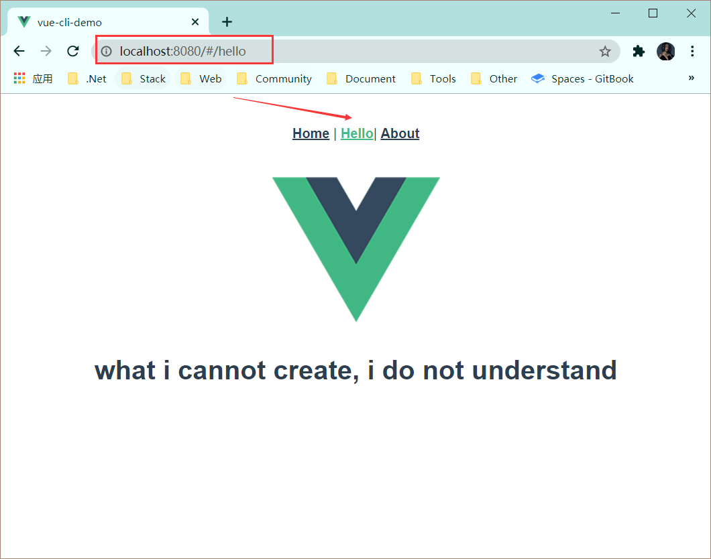
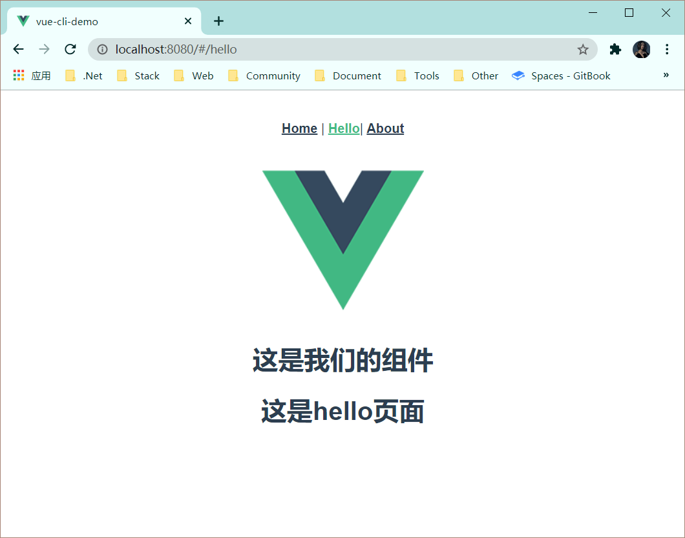
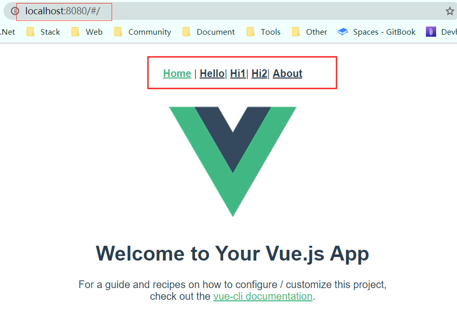
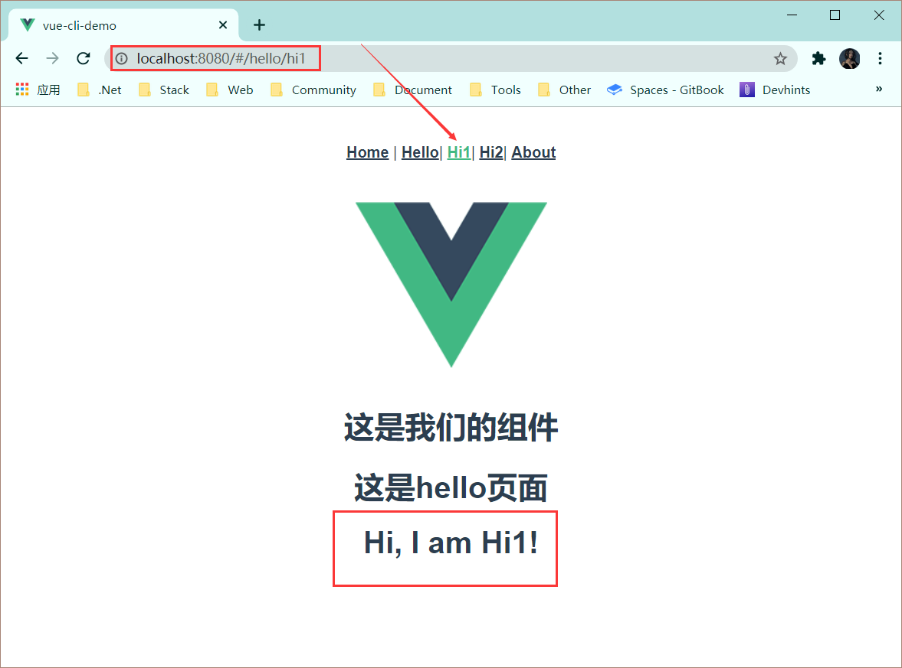

# Vue-Router

## 实现原理

SPA(single page application):单一页面程序，只有一个完整的页面；在加载页面的时候，不会加载整个页面，而是只更新某个指定的容器中的内容。单页面应用(SPA)的核心之一是：**更新视图而不重新请求页面；**Vue-Router在实现单页面前端路由时，提供了两种方式：Hash模式和History模式。

## Vue-Router配置路由

### 解读router/index.js文件

```js
import Vue from 'vue' //引入vue
import VueRouter from 'vue-router' //引入vue-router
import Home from '../views/Home.vue'  //引入根目录下的Home.vue组件

Vue.use(VueRouter) // Vue全局使用Router

const routes = [ // 配置路由
  {             
    path: '/',  // 连接对象
    name: 'Home', // 路由名称
    component: Home // 对应组件模板
  },
  {
    path: '/about',
    name: 'About',
    // route level code-splitting
    // this generates a separate chunk (about.[hash].js) for this route
    // which is lazy-loaded when the route is visited.
    component: () => import(/* webpackChunkName: "about" */ '../views/About.vue')
  }
]

const router = new VueRouter({
  routes
})

export default router

```

### 示例：

实现以下效果，点击Hello，打开一个新页面 ，地址栏 http://localhost:8080/#/hello



- 在src/view目录下，新建Hello.vue文件。

  包括3个部分，<template>、<script>和<style>

  ```vue
  <template>
   <div>
      
      <h1>这是hello页面</h1>
   </div>
  </template>
  
  <script>
  export default {
    name: 'Hello'
  }
  </script>
  ```

- 在src/components目录下，新建 demo.vue 文件,这是组件文件。

```vue
<template>
  <div>
    <h1>{{ msg }}</h1>
  </div>
</template>

<script>
export default {
  name: 'demo',
  props: {
    msg: String
  }
}
</script>
```

- 在视图中引入demo组件并且使用组件

```vue
<template>
 <div>
    
     <demo msg="这是我们的组件"></demo>
    <h1>这是hello页面</h1>
 </div>
</template>

<script>
// @ is an alias to /src
// 引入组件
import demo from '@/components/demo' 

export default {
  name: 'Hello',
  components: {
    // 注册组件
    demo
  }
}
</script>
```

- 增加路由配置：在router/index.js文件的routes[]中新增一个对象：

```javascript
// 先引入Hello视图
import Hello from '../views/Hello.vue'
// ...
{
   path: '/hello',
   name: 'Hello',
   component:Hello
}
```

- router-link制作导航

页面上需要有个像样的导航链接，点击就可以实现页面内容的变化。制作链接需要<router-link>标签。

```vue
<router-link to="/">[显示字段]</router-link>
```

- to：是我们的导航路径，要填写的是在router/index.js文件里配置的path值，如果要导航到默认首页，只需要写成  to=”/”  ，
- [显示字段] ：就是我们要显示给用户的导航名称，比如首页  新闻页。

在src/App.vue文件中加入以下代码：

```vue
 <router-link to="/hello">Hello</router-link>|
```

运行`npm run serve`



## Vue-Router配置子路由

子路由的情况一般用在一个页面有他的基础模版，然后它下面的页面都隶属于这个模版，只是部分改变样式。

接着上面的案例，在Hello页面下新家两个子页面，分别是 “Hi页面1” 和 “Hi页面2”，来实现子路由。

### 改造App.vue导航代码

用<router-link>标签增加了两个新的导航链接。

```vue
 <router-link to="/">Home</router-link> |
 <router-link to="/hello">Hello</router-link>|
 <router-link to="/hello/hi1">Hi1</router-link>|
 <router-link to="/hello/hi2">Hi2</router-link>|
 <router-link to="/about">About</router-link>
```



### 改写components/Hello.vue页面

在`Hello.vue`中加入<router-view>标签

```vue
<template>
 <div>
    
     <demo msg="这是我们的组件"></demo>
    <h1>这是hello页面</h1>
    <router-view>
      
    </router-view>
 </div>
</template>
```

### 在components目录下新建组件模板

```vue
<template>
  <div class="hello">
    <h1>{{ msg }}</h1>
  </div>
</template>
<script>
export default {
  name: 'hi',
  data () {
    return {
      msg: 'Hi, I am Hi1'
    }
  }
}
</script>
<style scoped>
</style>

// Hi2
<template>
  <div class="hello">
    <h1>{{ msg }}</h1>
  </div>
</template>
<script>
export default {
  name: 'hi',
  data () {
    return {
      msg: 'Hi, I am Hi2'
    }
  }
}
</script>
<style scoped>
</style>
```

### 修改router/index.js代码

子路由的写法是在原有的路由配置下加入children字段。

children字段后边跟的是个数组，数组里和其他配置路由基本相同，需要配置path和component。

```javascript
children:[
{path:'/',component:xxx},
{path:'xx',component:xxx},
```



## Vue-router参数传递

### 1、name传递参数 

1. 在路由文件src/router/index.js里配置name属性。

```javascript
routes: [
    {
      path: '/',
      name: 'Hello',
      component: Hello
    }
]
```

2. 模板里(src/App.vue)用$route.name的形势接收，比如直接在模板中显示：

```vue
<p>{{ $route.name}}</p>
```

 ### 2.通过<router-link>标签to传参

用<router-link>标签中的to属性进行传参，需要注意的是这里的to要进行一个绑定，写成`:to`

```vue
<router-link :to="{name:xxx,params:{key:value}}">valueString</router-link>
```

- name:路由配置文件中的name值
- params:传递的参数，对象形式，可以传递多个值

修改src/App.vue中的<router-link>标签

在模板里(src/cmponents/Hi1.vue)用$route.params.username进行接收.

```javascript
{{$route.params.username}}
```

## Vue-Router重定向

### 1、redirect基本重定向

在路由配置文件中（/src/router/index.js）把原来的component换成redirect参数。

```javascript
export default new Router({
  routes: [
    {
      path: '/',
      component: Hello
    },{
      path:'/params/:newsId(\\d+)/:newsTitle',
      component:Params
    },{
      path:'/goback',
      edirect:'/'
    }
  ]
})
```

这里设置了goback路由，但是它并没有配置任何component（组件），而是直接redirect到path:’/’下了，这就是一个简单的重新定向。

### 2、重定向时传递参数

我们已经学会了通过url来传递参数，那我们重定向时如果也需要传递参数怎么办？其实vue也已经为我们设置好了，我们只需要在ridirect后边的参数里复制重定向路径的path参数就可以了。可能你看的有点晕，我们来看一段代码：

```
{
  path:'/params/:newsId(\\d+)/:newsTitle',
  component:Params
},{
  path:'/goParams/:newsId(\\d+)/:newsTitle',
  redirect:'/params/:newsId(\\d+)/:newsTitle'
}
```

已经有了一个params路由配置，再设置一个goParams的路由重定向，并传递了参数。这时候路由参数就可以传递给params.vue组件了。参数接收方法和正常的路由接收方法一样。