# Vue-cli

## 介绍

[Vue CLI](https://cli.vuejs.org/zh/guide/)是一个基于Vue.js进行快速开发的完整系统，提供：

- 通过 `@vue/cli` 实现的交互式的项目脚手架。
- 通过 `@vue/cli` + `@vue/cli-service-global` 实现的零配置原型开发。
- 一个运行时依赖 (`@vue/cli-service`)，该依赖：
  - 可升级；
  - 基于 webpack 构建，并带有合理的默认配置；
  - 可以通过项目内的配置文件进行配置；
  - 可以通过插件进行扩展。
- 一个丰富的官方插件集合，集成了前端生态中最好的工具。
- 一套完全图形化的创建和管理 Vue.js 项目的用户界面。

Vue CLI 致力于将 Vue 生态中的工具基础标准化。它确保了各种构建工具能够基于智能的默认配置即可平稳衔接

## 系统组件

### CLI

CLI(`vue/cli`)是一个全局安装的npm包，提供了终端里的`vue`命令。

### CLI服务

CLI 服务 (`@vue/cli-service`) 是一个开发环境依赖。它是一个 npm 包，局部安装在每个 `@vue/cli` 创建的项目中。

### CLI插件

CLI 插件是向你的 Vue 项目提供可选功能的 npm 包，例如 Babel/TypeScript 转译、ESLint 集成、单元测试和 end-to-end 测试等

## 安装

使用`npm`命令安装：

```
npm install -g @vue/cli
```

检查是否安装成功：

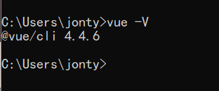

### 创建一个项目

#### vue create

```
vue create hello-world
```

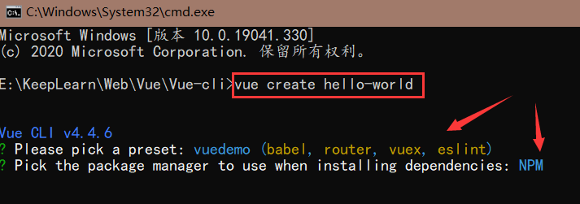

会被提示选取一个preset。可以选择默认的包含基本的Babel+ESLint

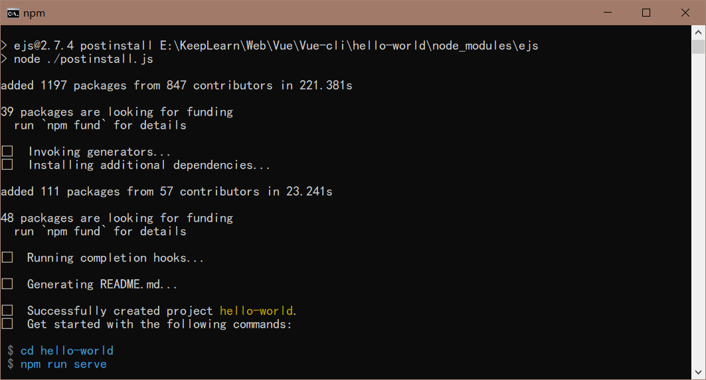

执行`cd hello-world`,来到项目根目录

执行：

```
npm run serve
```

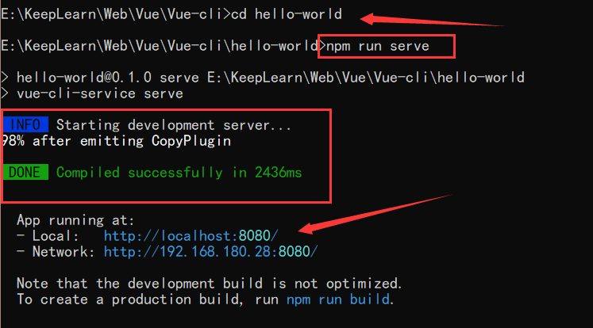

浏览器访问：http://localhost:8080/

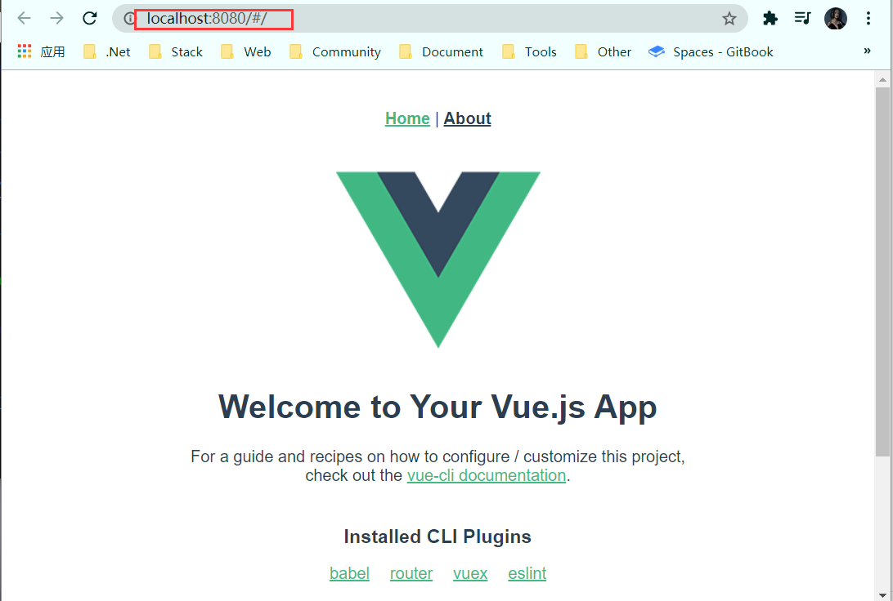

`vue create`命令可选项：

```
vue create --help
```

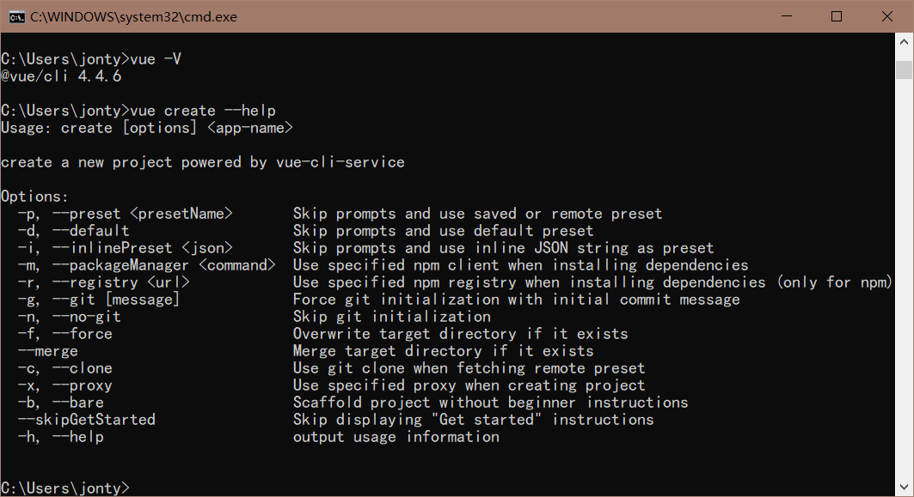

```cmd
用法：create [options] <app-name>

创建一个由 `vue-cli-service` 提供支持的新项目

选项：

  -p, --preset <presetName>       忽略提示符并使用已保存的或远程的预设选项
  -d, --default                   忽略提示符并使用默认预设选项
  -i, --inlinePreset <json>       忽略提示符并使用内联的 JSON 字符串预设选项
  -m, --packageManager <command>  在安装依赖时使用指定的 npm 客户端
  -r, --registry <url>            在安装依赖时使用指定的 npm registry
  -g, --git [message]             强制 / 跳过 git 初始化，并可选的指定初始化提交信息
  -n, --no-git                    跳过 git 初始化
  -f, --force                     覆写目标目录可能存在的配置
  -c, --clone                     使用 git clone 获取远程预设选项
  -x, --proxy                     使用指定的代理创建项目
  -b, --bare                      创建项目时省略默认组件中的新手指导信息
  -h, --help                      输出使用帮助信息
```

#### 使用图形化界面

通过`vue ui`命令以图形化界面创建和管理项目

```
vue ui
```


点击创建，选择目录，然后点击在此创建项目

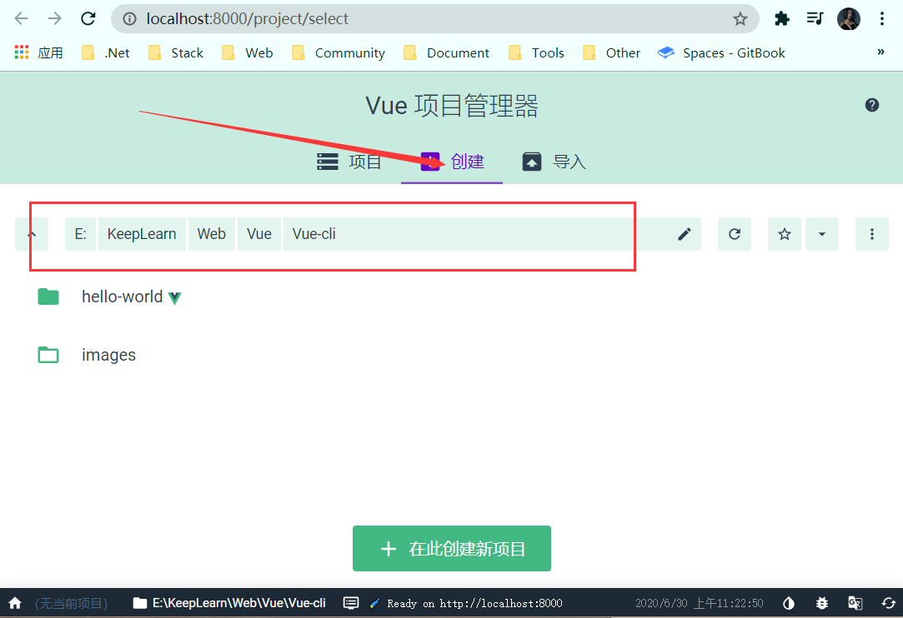

选择默认或者手动配置项目

> 预设就是一套定义好的插件和配置。可以将自己的配置保存成预设，方便以后创建项目使用

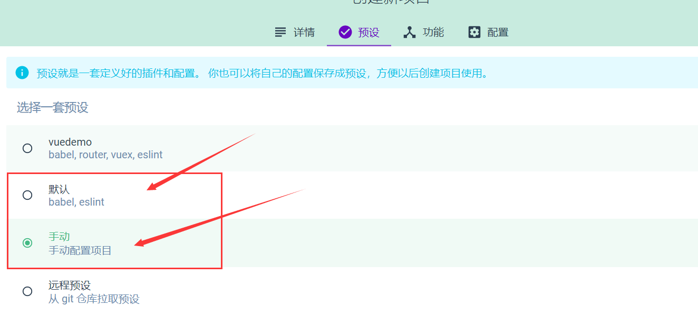

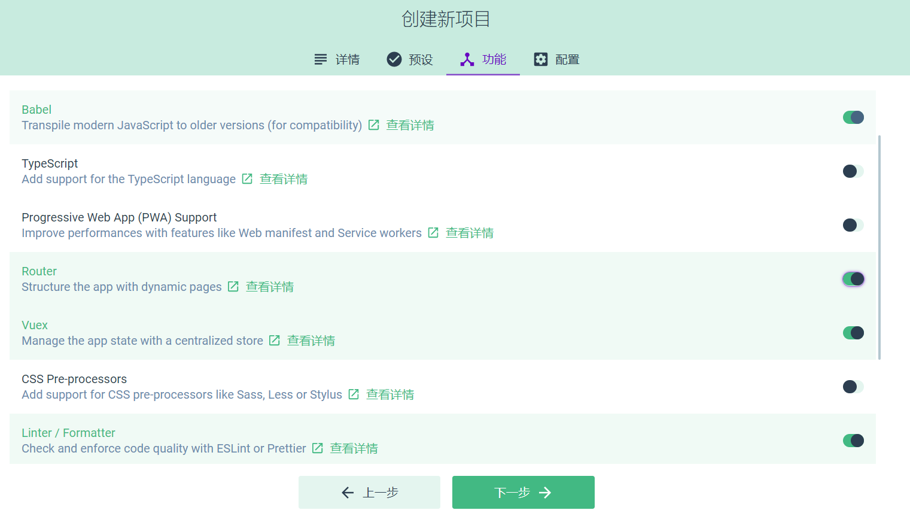

使用开源ESlint代码分析，关闭保存时编译，然后创建项目

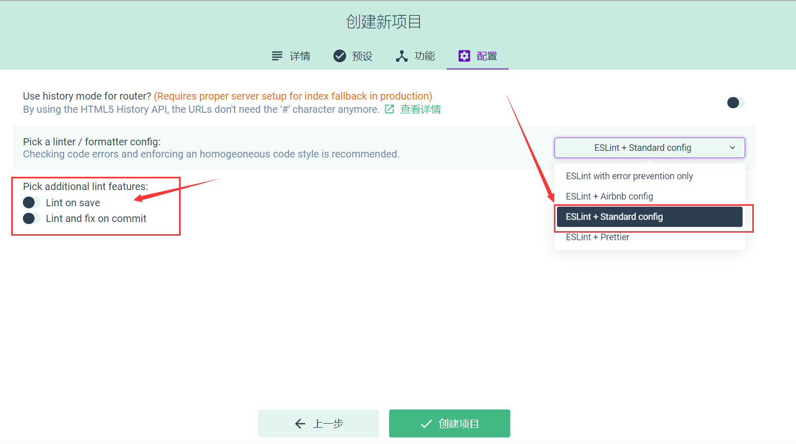

等待创建完成，进入仪表盘

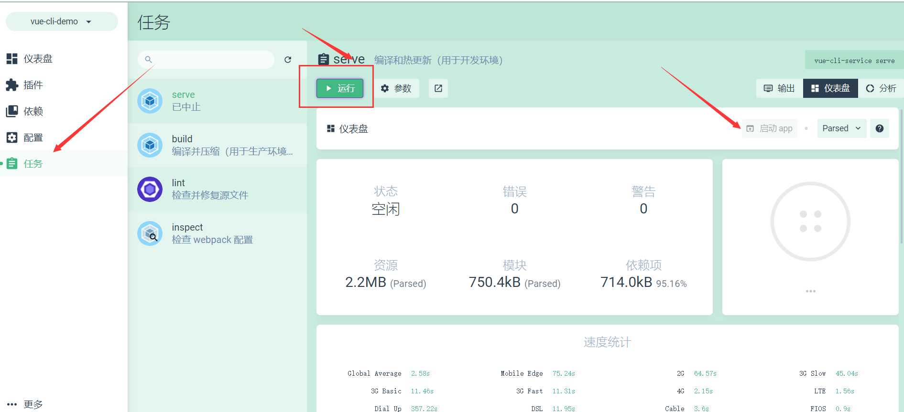

点击运行—>启动App


## CLI服务

### 使用命令

